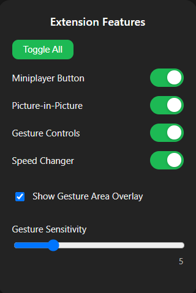
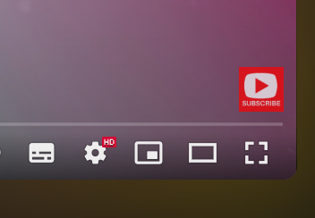

# 🎬YT-Experience-Enhancer

> A powerful, modern browser extension that adds miniplayer, picture-in-picture, advanced gesture controls, and a live settings popup to YouTube's video player.

[](https://opensource.org/licenses/MIT)
[](https://developer.chrome.com/docs/extensions/mv3/intro/)

## ✨ Features

- 🎯 **One-Click Miniplayer** — Instantly activate YouTube's miniplayer mode with a single click
- 🖼️ **Picture-in-Picture Mode** — Float videos in a dedicated window using browser's native PiP API
- 🖱️ **Gesture Controls** — Adjust brightness (left edge) and volume (right edge, up to 200%) by scrolling on the video. Center is a safe zone.
- 💡 **On-Screen Overlay** — See current brightness and volume percentage at the top center of the video when changed.
- 🔊 **Volume Boost** — Uses Web Audio API for true volume amplification up to 200%.
- ⌨️ **Keyboard Shortcut** — Works seamlessly with YouTube's native "i" keyboard shortcut for miniplayer
- 🔄 **Auto-Injection** — Automatically maintains buttons and gesture controls across page navigation and DOM changes
- 🎨 **Native Design** — Styled to match YouTube's native player controls perfectly
- ⚡ **Lightweight** — Minimal performance impact with efficient code
- 🛠️ **Popup Settings Panel** — Instantly toggle features, adjust gesture sensitivity, and show/hide gesture area overlays—no refresh needed!
- 👆 **Gesture Area Overlay** — Visualize the left (brightness), center (safe), and right (volume) gesture zones with labels directly on the video (toggle in popup)
- 🎚️ **Adjustable Sensitivity** — Fine-tune gesture control sensitivity from the popup
- 🟢 **Live Feature Toggling** — All settings apply in real time—no need to refresh the page

## 🌐 Browser Support

This extension is built using **Manifest V3** and is compatible with the following browsers:

| Browser           | Supported       | Installation Method               |
| ----------------- | --------------- | --------------------------------- |
| 🟢 Google Chrome  | ✅ Yes (v88+)   | `chrome://extensions/`            |
| 🔵 Microsoft Edge | ✅ Yes (v88+)   | `edge://extensions/`              |
| 🟠 Brave Browser  | ✅ Yes (v1.20+) | `brave://extensions/`             |
| 🟣 Opera          | ✅ Yes (v74+)   | `opera://extensions/`             |
| 🔴 Firefox        | ⚠️ Not yet      | Manifest V3 support in progress   |
| 🔵 Safari         | ⚠️ Not yet      | Requires Safari-specific manifest |

> **Note**: All Chromium-based browsers that support Manifest V3 should work with this extension.

## 📦 Installation

### Method 1: Install from Releases (Recommended)

1. **Download** the latest release from the [Releases page](../../releases)
2. **Extract** the ZIP file to a folder on your computer
3. **Open** your browser's extension page:
   - **Chrome**: Navigate to `chrome://extensions/`
   - **Edge**: Navigate to `edge://extensions/`
   - **Brave**: Navigate to `brave://extensions/`
   - **Opera**: Navigate to `opera://extensions/`
4. **Enable Developer Mode** by toggling the switch in the top-right corner
5. **Click** "Load unpacked" button
6. **Select** the extracted folder
7. **Done!** The extension is now installed and active

### Method 2: Install from Source

```bash
# Clone the repository
git clone https://github.com/rudrarathod/yt-mini-player-extention.git

# Navigate to the folder
cd yt-mini-player-extention

# Follow steps 3-7 from Method 1 above
```

## 🚀 How to Use

### Using the Miniplayer Button

1. **Navigate** to any YouTube video
2. **Look** for the miniplayer button in the video player controls (located next to the settings gear icon)
3. **Click** the button to activate miniplayer mode
4. The video will shrink to the bottom-right corner, allowing you to browse YouTube while watching

### Using the Picture-in-Picture Button

1. **Navigate** to any YouTube video
2. **Look** for the picture-in-picture button in the video player controls (located before the settings gear icon)
3. **Click** the button to open the video in a floating window
4. The video will appear in a dedicated floating window that stays on top of other applications

### Using Gesture Controls (Brightness & Volume)

1. **Hover** your mouse over any YouTube video.
2. **Scroll up/down** on the left 30% of the video to increase/decrease brightness (capped at 100%).
3. **Scroll up/down** on the right 30% of the video to increase/decrease volume (up to 200% with true amplification).
4. The center 40% of the video is a safe zone—scrolling there does nothing.
5. A percentage overlay will appear at the top center of the video when you adjust brightness or volume.

### Using the Keyboard Shortcut

Simply press the **`i`** key while watching any YouTube video to toggle miniplayer mode.

### Visual Guide

- **Popup Panel**: Click the extension icon to open the popup and toggle features, adjust sensitivity, or show the gesture area overlay instantly.
- **PiP Button**: Located before the settings gear icon
- **Miniplayer Button**: Located next to the settings gear icon
- **Gesture Area Overlay**: Toggle in the popup to see colored zones and labels for brightness, safe area, and volume on the video





## 🔧 How It Works

The extension uses modern web technologies to seamlessly integrate with YouTube:

1. **Content Script Injection** — The `content.js` script runs on all YouTube pages
2. **DOM Manipulation** — Creates and injects button elements into YouTube's player controls
3. **Event Simulation** — Miniplayer button simulates pressing the "i" key
4. **Native PiP API** — Picture-in-Picture button uses browser's `requestPictureInPicture()` API
5. **Navigation Handling** — Listens for YouTube's SPA navigation events
6. **Mutation Observer** — Monitors DOM changes to ensure buttons and gesture controls persist
7. **Popup UI** — All feature toggles, gesture sensitivity, and overlay options are managed live via the popup (no refresh required)

## 📁 Project Structure

```

yt-mini-player-extention/
├── manifest.json       # Extension configuration (Manifest V3)
├── content.js          # Main content script for all features and overlays
├── popup.html          # Popup UI for live feature toggling and settings
├── popup.js            # Popup logic for syncing settings and live updates
└── README.md           # This documentation file
```

### File Descriptions

- **`manifest.json`** — Defines the extension's metadata, permissions, and behavior
- **`content.js`** — Contains the logic for all features: miniplayer, PiP, gesture controls, overlays, and live feature toggling
- **`popup.html`** — Modern popup UI for toggling features, adjusting sensitivity, and showing overlays
- **`popup.js`** — Handles popup logic, chrome.storage sync, and real-time updates
- **`README.md`** — Complete documentation and usage instructions

## 🔐 Permissions

This extension requires minimal permissions to function:

| Permission         | Purpose                                         | Scope                       |
| ------------------ | ----------------------------------------------- | --------------------------- |
| `scripting`        | To inject the content script into YouTube pages | Required for functionality  |
| `host_permissions` | Access to YouTube domain only                   | `https://www.youtube.com/*` |

**Privacy Guarantee**: This extension only runs on YouTube and does not collect, transmit, or store any user data.

## 🛠️ Development

Want to contribute or modify the extension? Here's how to get started:

```bash
# Clone the repository
git clone https://github.com/rudrarathod/yt-mini-player-extention.git
cd yt-mini-player-extention

# Make your changes to content.js or manifest.json

# Load the extension in your browser (Developer Mode)
# Test your changes on YouTube
```

## ❓ Troubleshooting

**Buttons not appearing?**

- Ensure the extension is enabled in your browser
- Check that you're using a compatible browser

**Gesture controls not working?**

- Make sure you are scrolling on the left or right edge of the video (not the center)
- Try toggling the Gesture Controls feature off and on in the popup
- Some browser extensions or YouTube overlays may interfere with gesture detection

**Picture-in-Picture not working?**

- Ensure your browser supports the Picture-in-Picture API
- Check that PiP is not disabled in browser settings
- Some browsers may require user gesture before allowing PiP

**Need more help?**

- Open an issue on [GitHub Issues](../../issues)

## 📄 License

This project is licensed under the MIT License - see below for details:

```
MIT License

Copyright (c) 2024 YouTube Miniplayer Button Extension

Permission is hereby granted, free of charge, to any person obtaining a copy
of this software and associated documentation files (the "Software"), to deal
in the Software without restriction, including without limitation the rights
to use, copy, modify, merge, publish, distribute, sublicense, and/or sell
copies of the Software, and to permit persons to whom the Software is
furnished to do so, subject to the following conditions:

The above copyright notice and this permission notice shall be included in all
copies or substantial portions of the Software.

THE SOFTWARE IS PROVIDED "AS IS", WITHOUT WARRANTY OF ANY KIND, EXPRESS OR
IMPLIED, INCLUDING BUT NOT LIMITED TO THE WARRANTIES OF MERCHANTABILITY,
FITNESS FOR A PARTICULAR PURPOSE AND NONINFRINGEMENT. IN NO EVENT SHALL THE
AUTHORS OR COPYRIGHT HOLDERS BE LIABLE FOR ANY CLAIM, DAMAGES OR OTHER
LIABILITY, WHETHER IN AN ACTION OF CONTRACT, TORT OR OTHERWISE, ARISING FROM,
OUT OF OR IN CONNECTION WITH THE SOFTWARE OR THE USE OR OTHER DEALINGS IN THE
SOFTWARE.
```

## 🤝 Contributing

Contributions, issues, and feature requests are welcome! Feel free to check the [issues page](../../issues).

## ⭐ Show Your Support

If you find this extension helpful, please consider giving it a star on GitHub!

---

**Made with ❤️ for YouTube enthusiasts**
